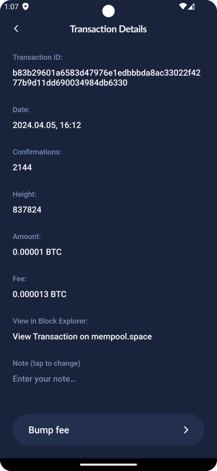
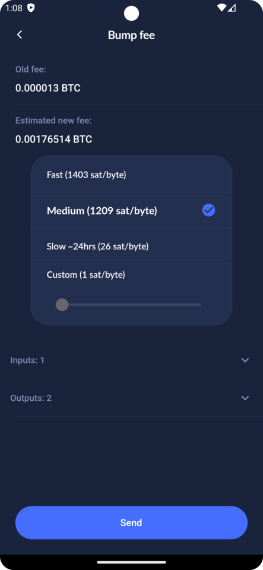
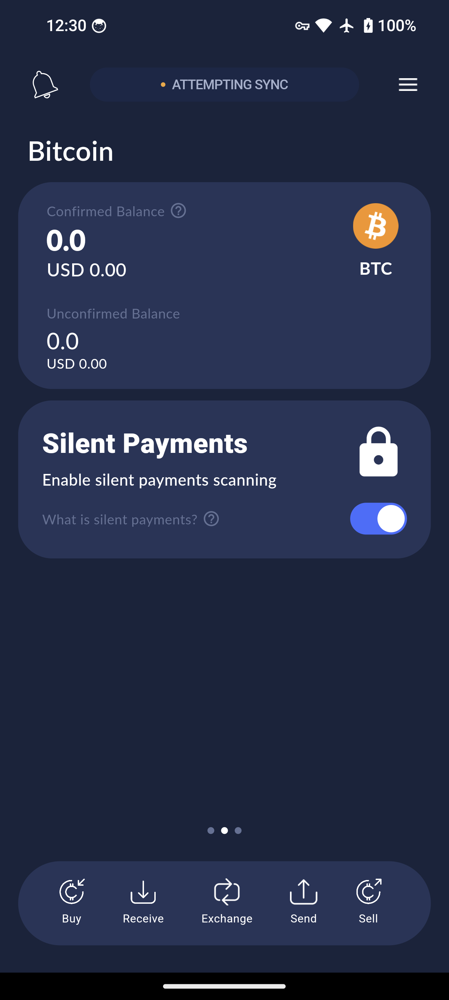
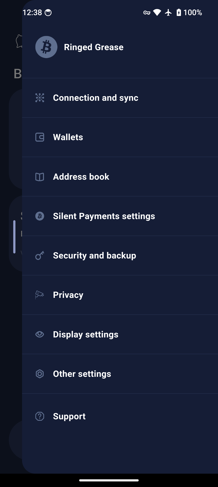
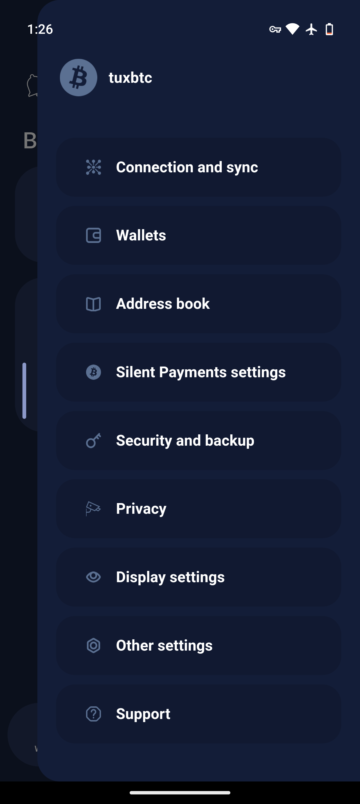
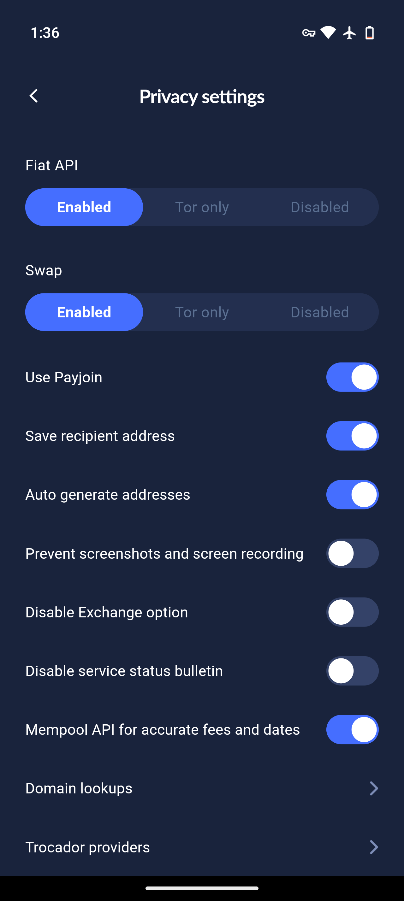
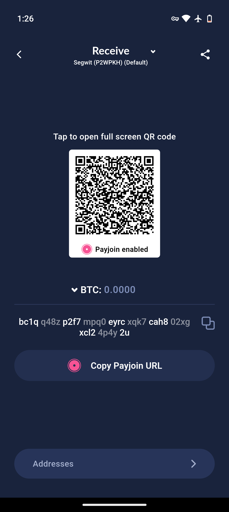

# :crypto-bitcoin: Bitcoin

!!! note ""
    Official Website: [bitcoin.org](https://bitcoin.org/){:target="_blank"}

Bitcoin `(BTC)` is the first cryptocurrency, created in 2009, functioning on a decentralized network where transactions are recorded on a blockchain. It aims to enable secure, transparent, and intermediary-free digital payments.

There's a cap set at 21 million bitcoins that will ever be created, which introduces a scarcity factor similar to gold. Bitcoin has since become a popular investment asset, a speculative bubble to critics, and a symbol of financial freedom to its advocates, aiming to provide an alternative to conventional banking systems.

## Seed Types

BIP-39 seed type is generated by default, with an option to change to Electrum seed type in the `Advanced Settings` on the creation screen.

### Derivation Paths

Electrum: `m/0'`

BIP-39: `m/84'/0'/0`

## Addresses

We automatically generate new Bitcoin addresses after each use for better privacy. Previous addresses continue to work.

There are multiple address types supported.

* Silent Payments
* Segwit (P2WPKH)
* Taproot (P2TR)
* Segwit (P2WSH)
* Segwit-Compatible (P2SH)
* Legacy (P2PKH)

You can switch to a different address type by going to the `Receive` screen and clicking on the current address type at the top of the screen.

{:width="32%"}
{:width="32%"}

## Seed format

Bitcoin wallets only currently support being created using the Electrum seed format. We support restoring seeds generated in the Electrum and BIP-39 seed format.

BIP-39 restoring will check for multiple derivation paths, and ask you which one you would like to use if transactions are detected on multiple paths.

## Bitcoin fee levels

We recommend leaving your Cake Wallet fee for Bitcoin as `Medium`.

| Cake Wallet name | estimatefee value | Description |
| --- | --- | --- |
| Slow ~24hrs | 100 | Save on fees if you can wait a full day for the transaction to be confirmed. |
| Medium | 5 | The best blend of speed and cost. You'll usually get a confirmation within 3 blocks. |
| Fast | 1 | Aggressively pursues inclusion in the next block, usually overpaying. |

## RBF (Replace-By-Fee)

As of Cake Wallet version `4.15.4`, the Bitcoin wallet supports using RBF (Replace-by-fee), and is enabled by default for every transaction.

RBF allows you to modify the fee after you have already sent a transaction. You can do this by going to the `Transactions` screen, clicking on the desired transaction, the clicking `Bump fee`. Once you are in the `Bump fee` page, you can set your fee and click `Send`.

{:width="32%"}
{:width="32%"}

## Silent Payments

Silent Payments (BIP-352) is a protocol for static payment addresses in Bitcoin without on-chain linkability of payments or a need for on-chain notifications.

This protocol protects the receivers privacy by automatically having the sender generate a new Taproot address on chain only the receiver can know is theirs and spend from everytime a transaction is sent to their Silent Payments address.

For a more detailed explanation on how Silent Payments works, please visit [silentpayments.xyz](https://silentpayments.xyz/){:target="_blank"}.

One major difference of Silent Payments is in order to fully protect the privacy of the user and not have the server know which Silent Payments transactions belong to them, we opt for on-device scanning of transactions instead of having a light wallet and making the node do all the work for us. This incurrs greater synchronization time, device power consumption and hardware utilization, but protects the privacy of the user much more.

Silent Payment addresses start with `sp1`.

### Scanning

In order to enable Silent Payments, tap the switch on the "Silent Payments" card to start scanning blocks for Silent Paymemnts.

{:width="32%"}

The wallet will start scanning from the height of when you first opened it after installing 4.18.0 or higher, or continue where it left off. Silent Payments scanning will automnatically turn off once it has reached the current blockheight. If you would like it to automatically scan for Silent Payment transactions on new blocks, please toggle an option under Menu -> Silent Payments settings -> "Set Silent Payments always scanning" to on. Silent Payments scanning will automatically toggle on if there are new blocks to scan and toggle back off when it's finished.

{:width="32%"}
{:width="32%"}

### Receiving

In order to receive a Silent Payment, you must give the sender your Silent Payments address, which can be found by switching the address type to Silent Payments following the instructions under the [addresses](http://localhost:4000/docs/cryptos/bitcoin/#addresses) section of this page. When you want to receive the transaction in the wallet, you must enable Silent Payments scanning.

### Sending

You can send Bitcoin to an existing Silent Payments address (`sp1xxx`) using the same flow. No extra work is required to send to a Silent Payments address, the wallet will handle the unique address generation in the background before sending your transaction.

## PayJoin

Bitcoin PayJoin is a privacy-enhancing feature that allows multiple users to combine their transactions into a single one, making it more difficult for third parties to track individual transactions. When a user initiates a PayJoin transaction, their wallet combines their payment with other users' payments, resulting in a single transaction that includes multiple inputs and outputs. This technique makes it challenging for observers to determine which output corresponds to which user's payment, thereby improving overall transaction privacy.

!!! note
    Using PayJoin requires both parties to be online with their wallet open for the duration of the transaction, and requires both parties to be using a PayJoin compatible wallet.

### Enable PayJoin

1. To enable PayJoin, open the app menu then click on `Privacy`.

    {:width="32%"}

2. Toggle the `PayJoin` option to enable it.

    {:width="32%"}

3. Open the `Receive` screen, and you will be presented with a PayJoin QR code and copy button.

    {:width="32%"}
