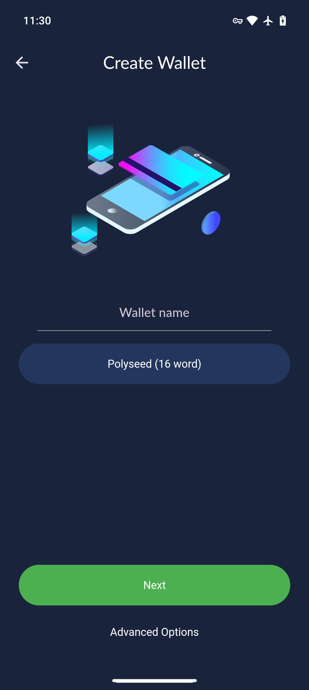
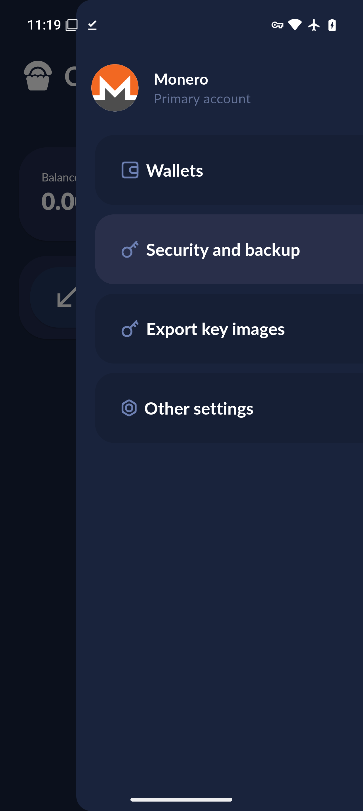
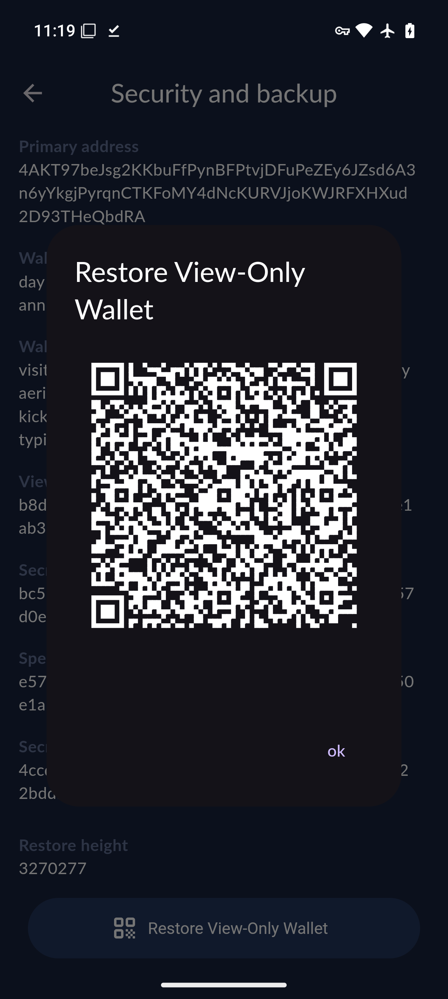
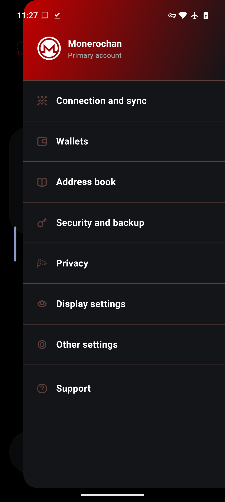
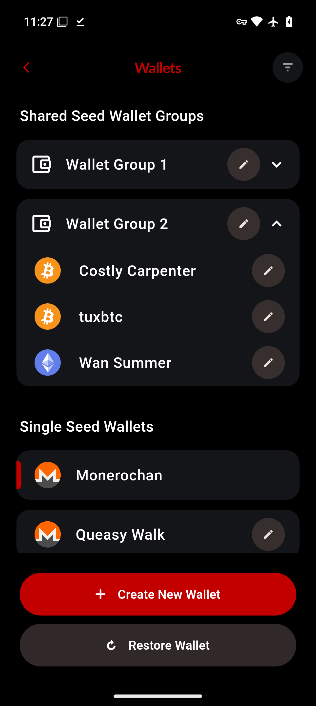
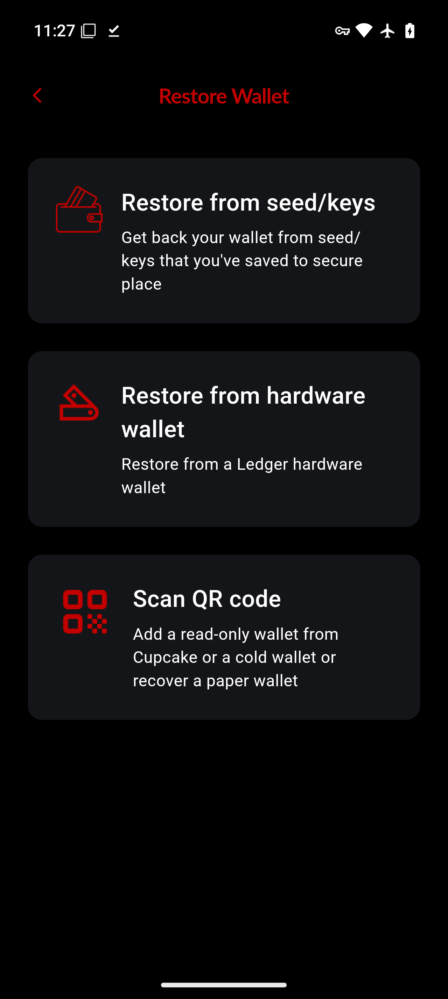

# Setup

## Step 1

Create or Restore your first wallet from the setup wizard.

{:width="32%"}
{:width="32%"}

## Step 2

Once you've created or restored a wallet, you'll need to restore the view-only wallet to Cake Wallet.

To restore the view-only wallet, open the `Menu`, select `Security and backup`, then select `Restore View-Only Wallet` from the bottom of the page.

{:width="32%"}
[{:width="32%"}](restore-qr.png)

## Step 3

From Cake Wallet, enter the `Wallets` screen from either the Menu or the button on the bottom bar. Select `Restore Wallet`, then select `Scan QR code`. Scan the view-only wallet QR code from Cupcake.

{:width="32%"}
{:width="32%"}
{:width="32%"}

### Synchronizing balance

If you're restored an existing wallet with transactions, you'll need to synchronize the balance after scanning the blockchain from Cake Wallet.

You can do this by `exporting outputs` from Cake Wallet, then scanning the `key images` from Cupcake.

From Cake Wallet, open the `Menu`, select `Export outputs`. Scan the live QR from Cupcake. If successful, Cupcake will present a QR with the `key images`. Scan this from Cake Wallet.